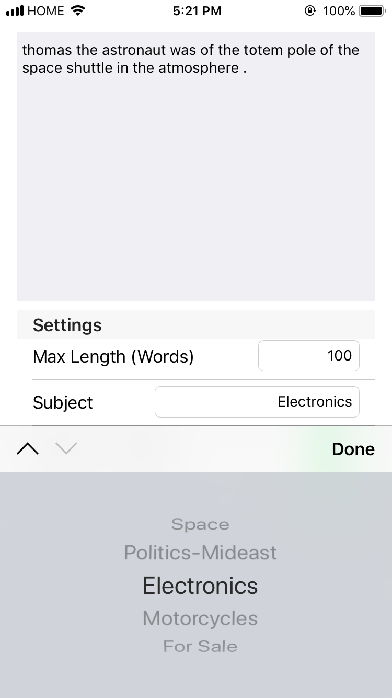

# article-generator

Article-generator is an IOS app that allows users to harness the power of neural networks to generate news articles in the following topics:
- Space
- Medicine
- Motorcycles
- Electronics
- Politics about the Middle east
- For Sale ads

The app uses CoreML models generated by [word-rnn](https://github.com/charlesyz/word-rnn). If you want more information about the neural network itself, please visit the word-rnn repository linked above.

## Post Mortem:
Article Generator was a wonderful introduction into python neural network libraries and CoreML. It was also a great opportunity to delve further into IOS Development, especially with AutoLayout and constraints. 

Working with text generation posed a lot of new issues. Previously, I had worked with neural networks that I created myself in [Tetris-AI](https://github.com/charlesyz/Tetris-Ai). This was my first time using Keras and TensorFlow. The biggest hurdle was definitely cleaning the data. When my data was not properly cleaned, it performed significantly worse as the dictionary size was larger than it needed to be, and there was a lot of junk data. Using Keras and Tensorflow also gave me a lot of freedom to try different models to find the best setup. In the future, I hope to experiment and study more of the statistics around what makes a model good, and how to optimize models. 

Fun things I noticed about the neural network:
- The neural network does not know any grammar rules, yet learns them intuitively. For example, after "the", it will always put a noun. After a noun, there will usually be a verb. 
- Contractions were always put together. When my data cleaning was flawed, it removed instances of ', thereby splitting any contractions. Yet, contractions were always grouped together. For example, you'd often see "we re" or "thing s". It would be very rare for there to be a incomplete contraction

# Photos

---

---

---

---

